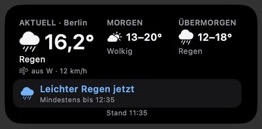

# Scriptable Wetter Widget

Ein kompaktes, mittleres iOS-Widget für [Scriptable](https://scriptable.app/).
Es zeigt das aktuelle Wetter, die Aussichten für morgen und übermorgen sowie
eine klare Regen-, Schnee- oder Glätteinformation für die nächsten 30 Minuten.

## Screenshot

Echte Scriptable-Vorschau mit dem Beispielstandort Berlin:

## Anzeige

- **Oben links:** „Aktuell“ und Ort, Wetterzustand, Temperatur und Windrichtung.
- **Oben mittig:** Wetter und Tiefst-/Höchsttemperatur für morgen.
- **Oben rechts:** Wetter und Tiefst-/Höchsttemperatur für übermorgen.
- **Darunter:** ein Klartext-Hinweis, ob und in wie vielen Minuten Regen oder
  Schnee beginnt und bis wann er voraussichtlich anhält. Der Beginn wird im
  5-Minuten-Raster angegeben.
- **Ganz unten:** Stand der verwendeten Wetterdaten.

## Installation

1. Installiere **Scriptable** auf dem iPhone.
2. Erstelle in Scriptable ein neues Script.
3. Kopiere den Inhalt von [`wetter-widget.js`](wetter-widget.js) hinein und speichere das Script.
4. Starte es einmal direkt in Scriptable und erlaube den Standortzugriff.
5. Füge ein mittleres Scriptable-Widget zum Home-Bildschirm hinzu und wähle das gespeicherte Script aus.

Beim Antippen öffnet sich eine Detailansicht mit zusätzlichen Wetterangaben.
iOS bestimmt den tatsächlichen Aktualisierungszeitpunkt des Widgets.

## Daten und Datenschutz

Das Script verwendet DWD-Wetter-, Radar- und Warninformationen über
[Bright Sky](https://brightsky.dev/). Für den Ortsnamen wird die
Standortauflösung von iOS genutzt. Es sind kein API-Schlüssel und kein eigener
Server erforderlich.

Die Koordinaten werden für die Wetterabfragen an Bright Sky übermittelt. Die
angezeigte Niederschlagsart und das örtliche Glätterisiko sind Näherungen und
keine Garantie für den Zustand einer bestimmten Straße.

Bereits die kleinste vom Radar gemeldete Niederschlagsmenge von 0,01 mm je
5 Minuten wird als leichter Regen erkannt. Eine ausdrückliche aktuelle
DWD-Stationsmeldung wie „Regen“ hat Vorrang vor einem allgemeinen Wolkensymbol.
