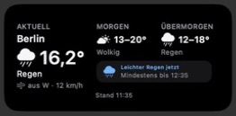
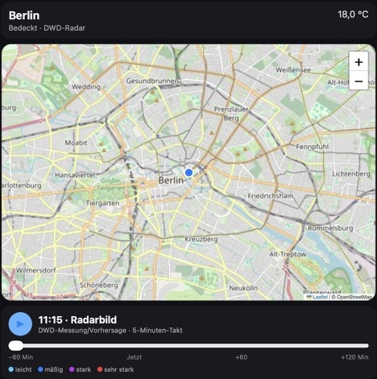

# Scriptable Wetter Widget

Ein Wetter-Widget in kleiner, mittlerer und großer Größe für [Scriptable](https://scriptable.app/).
Es zeigt das aktuelle Wetter, die Aussichten für morgen und übermorgen sowie
eine klare Regen-, Schnee- oder Glätteinformation bis zum Ende des Tages.

## Screenshot

Echte Scriptable-Vorschau mit dem Beispielstandort Berlin:

Radaransicht nach dem Antippen des Widgets:

## Anzeige

- **Klein:** aktuelles Wetter und der wichtigste Wetterhinweis.
- **Mittel:** aktuelles Wetter, Wind, morgen und übermorgen sowie der wichtigste Hinweis.
- **Groß:** zusätzlich fünf Stundenwerte und bis zu drei getrennte Niederschlagsphasen.
- **Klartext-Hinweis:** ob und wann Regen oder Schnee beginnt
  und bis wann er voraussichtlich anhält. Bis zwei Stunden im Voraus wird das
  5-Minuten-Radar verwendet, danach die stündliche Tagesprognose. Bleibt der ganze
  Tag trocken, steht dort ausdrücklich „Heute bleibt es trocken“ und darunter
  „Kein Regen oder Schnee erwartet“.
- **Mengen und Sicherheit:** kurze Schauer, ungefähre Niederschlagsmenge,
  verständliche Wahrscheinlichkeit und unsichere Zeiträume werden benannt.
- **Warnungen:** amtliche Warnungen vor Glätte, Gewitter, Sturm, Starkregen,
  Schnee, Hagel, Nebel oder Hitze haben Vorrang.
- **Datenstand:** Offline-Daten werden mit Uhrzeit und bei Bedarf ihrem Alter markiert.

## Installation

1. Installiere **Scriptable** auf dem iPhone.
2. Erstelle in Scriptable ein neues Script.
3. Kopiere den Inhalt von [`wetter-widget.js`](wetter-widget.js) hinein und speichere das Script.
4. Starte es einmal direkt in Scriptable und erlaube den Standortzugriff.
5. Füge ein kleines, mittleres oder großes Scriptable-Widget zum Home-Bildschirm hinzu
   und wähle das gespeicherte Script aus.

Beim Antippen öffnet sich eine eigene Radaransicht mit Standortkarte,
10-km-Radarbereich, Zeitschieber und Animation im 5-Minuten-Takt.
Das Radar wird zellenweise auf die vier geografischen Eckpunkte des DWD-Rasters
abgebildet, statt als rechteckiges Bild über die Karte gelegt zu werden.
iOS bestimmt den tatsächlichen Aktualisierungszeitpunkt des Widgets.

## Einstellungen

Am Anfang von `wetter-widget.js` können unter `SETTINGS` unter anderem angepasst werden:

- `fixedLocation`: fester Ort statt GPS, zum Beispiel
  `{ latitude: 52.52, longitude: 13.405, name: "Berlin" }`
- `rainThreshold`: Empfindlichkeit des 5-Minuten-Radars
- `hourlyRainThreshold`: Mindestmenge der Stundenprognose
- `showProbability`: Wahrscheinlichkeitsformulierungen ein- oder ausschalten
- `use24Hour`: 24- oder 12-Stunden-Zeitformat
- `warningTypes`: angezeigte Warnarten
- `colors`: Hintergrund-, Text-, Regen-, Schnee- und Warnfarben
- `radarMapDistance` und `radarMapZoom`: Größe und Zoom der Radarkarte

## Tests

Die Logiktests lassen sich außerhalb von Scriptable mit `node tests/notice.test.js`
ausführen. Sie prüfen unter anderem Trockenheit, getrennte Regenphasen, zeitgenauen
Schnee, Glatteis, Warnarten, Wahrscheinlichkeiten, unvollständige Vorhersagen und
veraltete Offline-Daten.

## Daten und Datenschutz

Das Script verwendet DWD-Wetter-, Radar- und Warninformationen über
[Bright Sky](https://brightsky.dev/). Für den Ortsnamen wird die
Standortauflösung von iOS genutzt. Es sind kein API-Schlüssel und kein eigener
Server erforderlich.

Die Grundkarte der Radaransicht stammt von [OpenStreetMap](https://www.openstreetmap.org/)
und wird mit [Leaflet](https://leafletjs.com/) dargestellt.

Die Koordinaten werden für die Wetterabfragen an Bright Sky übermittelt. Die
angezeigte Niederschlagsart und das örtliche Glätterisiko sind Näherungen und
keine Garantie für den Zustand einer bestimmten Straße.

Bereits die kleinste vom Radar gemeldete Niederschlagsmenge von 0,01 mm je
5 Minuten wird als leichter Regen erkannt. Eine ausdrückliche aktuelle
DWD-Stationsmeldung wie „Regen“ hat Vorrang vor einem allgemeinen Wolkensymbol.
Für den restlichen Tag gilt in der Stundenprognose eine Schwelle von 0,05 mm.
